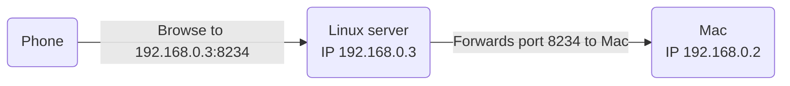
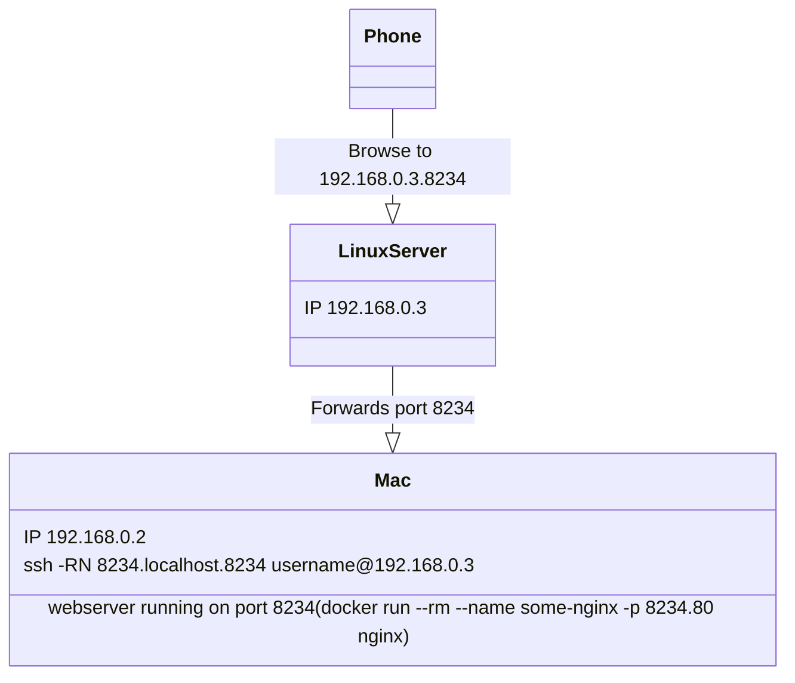
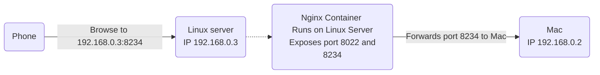

# Daikatana

> SSH Tunnel for accessing a web server on a firewalled Mac

I want to share my local development server with a coworker that is working remotely.

My macbook is completely firewalled and incoming connections are blocked and nobody seems to know what to do to open it up.

Only incoming SSH connections are allowed. This made me think I can set up an SSH tunnel from another local machine that I have full control over and route the traffic over that. This uses `ssh -R`, 

Example:

```
Mac
IP 192.168.0.2
webserver running on port 8234 (docker run --rm --name some-nginx -p 8234:80 nginx)
ssh -RN 8234:localhost:8234 username@192.168.0.3

 /\
 || 

Linux server
IP 192.168.0.3
Forwards port 8234 to Mac

 /\
 ||

Phone
Browse to 192.168.0.3:8234
```



Mac runs:

- Webserver on port 8234: `docker run --rm --name some-nginx -p 8234:80 nginx`
- SSH Tunnel: `ssh -R -N 8234:localhost:8234 username@192.168.0.3`



This SSH makes it possible to run `curl http://localhost:8234` on the Linux Server, but `curl http://192.168.0.3:8234` will still fail. You may find that people advise to modify SSH server settings, but this is potentially dangerous because you might expose more services than intended. E.g. https://www.devdungeon.com/content/expose-local-port-over-remote-vps-ssh-remote-port-forwarding

Instead I will try to set up a Docker container with a reverse proxy and SSH to that directly. This is inspired by: https://github.com/robzhu/nginx-local-tunnel and https://linuxconfig.org/how-to-connect-to-docker-container-via-ssh

That would look like this:



Linux server runs:

- Daikatana: `docker run --rm --name daikatana -p 8022:22 -p 8234:80 daikatana`

Mac runs:

- Webserver on port 8234: `docker run --rm --name some-nginx -p 8234:80 nginx`
- SSH Tunnel: `ssh -R 8234:localhost:8234 username@192.168.0.3 -p 8022`

Note that webservers run with webpack-dev-server need the `--host 0.0.0.0` flag to be accessible.

## Starting Daikatana

NOTE: this assumes the service to be tunneled runs on port 8234. If it runs on another port, e.g. 8001, replace 8234 by 8001 in ALL places, so both docker-compose and the ssh command in BOTH the incoming and outgoing position.

On Linux Server:

- Compose: `docker-compose up -d --build` or Build: `docker build -t daikatana .` and Run: `docker run --rm --name daikatana -p 8022:22 -p 8234:80 daikatana`
- Connect to bash: `docker exec -it daikatana /bin/bash`
- Start SSHd: `/etc/init.d/ssh status` and `/etc/init.d/ssh start`

On Mac:

- Terminal 1: webserver on port 8234: `docker run --rm --name some-nginx -p 8234:80 nginx` (Note that webservers run with webpack-dev-server may need the `--host 0.0.0.0` flag to be accessible)
- Terminal 2: SSH Tunnel: `ssh -R 8234:localhost:8234 root@192.168.0.3 -p 8022` (Note that webservers run with webpack-dev-server should *not* need to prefix 0.0.0.0 here, but you can try replacing with `ssh -R 0.0.0.0:8234...`)
- Browse to http://192.168.0.3:8234

## In progress

default nginx image (NOT alpine), should have an ssh server on board.
just run that and expose port 22

- docker exec -it daikatana /bin/bash
- /etc/init.d/ssh status
- passwd
- docker inspect -f "{{ .NetworkSettings.Networks.daikatana_default.IPAddress }}" daikatana

This should work after docker-compose: `ssh 127.0.0.1 -p 8022`, but instead this works `ssh root@172.17.0.2` and this works from Mac! `ssh root@192.168.0.3 -p 8022`

See https://github.com/mermaid-js/mermaid/blob/develop/README.md

