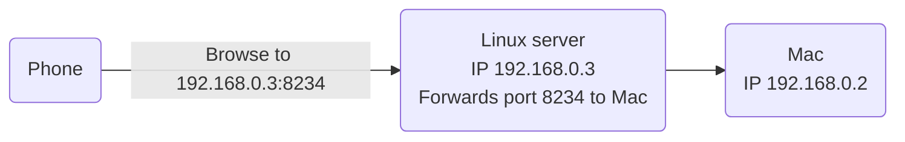

# Daikatana

> SSH Tunnel for accessing a web server on a firewalled Mac

I want to share my local development server with a coworker that is working remotely.

My macbook is completely firewalled and incoming connections are blocked and nobody seems to know what to do to open it up.

Only incoming SSH connections are allowed. This made me think I can set up an SSH tunnel from another local machine that I have full control over and route the traffic over that. This uses `ssh -R`, 

Example:

```
Mac
IP 192.168.0.2
webserver running on port 8234 (docker run --rm --name some-nginx -p 8234:80 nginx)
ssh -RN 8234:localhost:8234 username@192.168.0.3

 /\
 || 

Linux server
IP 192.168.0.3
Forwards port 8234 to Mac

 /\
 ||

Phone
Browse to 192.168.0.3:8234
```



This SSH makes it possible to run `curl http://localhost:8234` on the Linux Server, but `curl http://192.168.0.3:8234` will still fail. You may find that people advise to modify SSH server settings, but this is potentially dangerous because you might expose more services than intended.

Instead I will try to set up a Docker container with a reverse proxy and SSH to that directly. This is inspired by: https://github.com/robzhu/nginx-local-tunnel

Note that webservers run with webpack-dev-server need the `--host 0.0.0.0` flag to be accessible.

## In progress

default nginx image (NOT alpine), should have an ssh server on board.
just run that and expose port 22

See https://github.com/mermaid-js/mermaid/blob/develop/README.md
